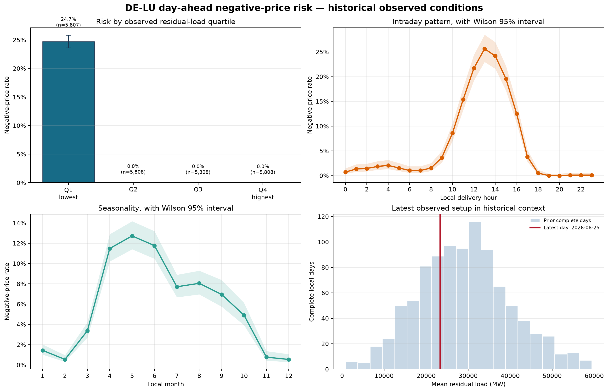

# DE-LU power-market view

Negative day-ahead prices occurred in **6.2% of 23,231 complete hourly
observations** from 1 January 2024 to 25 August 2026. In the lowest residual-load
quartile, the rate was **24.7%**: 1,435 of the sample's 1,436 negative-price hours.

The analysis combines settled SMARD prices with observed load, wind and solar,
derives residual load in DuckDB/SQL, and examines historical negative-price risk.
Observed fundamentals describe the settled market; they do not establish a
pre-auction signal, causality or a tradable strategy.

[Historical findings](outputs/market_view.md) · [Frozen methodology](PREREGISTRATION.md)

## Weather decision case

[August heatwave: German evening power](docs/event-memos/practice/2026-08-13-heatwave-evening.md)
examines a bullish price view, the missing matching entry price, the decision to
stay out and the realised outcome. It is reconstructed practice, written after
the event. A prospective memo will be linked here once one has been published.

## Run it

The commands below assume a fresh Python 3.11+ environment.

~~~powershell
python -m venv .venv
.venv\Scripts\Activate.ps1
python -m pip install -e ".[dev]"

de-power-fetch --start 2024-01-01 --end 2026-08-25
de-power-view
pytest
~~~

<code>de-power-fetch</code> retrieves the selected historical window, normalises
the five SMARD series into <code>data/processed/market_hourly.csv</code>, and
writes source provenance to <code>data/provenance.json</code>. Raw responses are
cached under <code>data/raw/</code> and ignored by Git.

<code>de-power-view</code> builds <code>data/market_view.duckdb</code>, runs the
checked-in SQL transformation in
<code>src/de_power_market_view/sql/market_view.sql</code>, writes the report to
<code>outputs/market_view.md</code>, saves the summary to
<code>outputs/results.json</code>, and creates
<code>outputs/negative_price_risk.png</code> together with
<code>outputs/negative_price_exploratory.png</code>.

Both commands read and write <code>data/</code> and <code>outputs/</code>
relative to the current working directory, so run them from the repository
root. Pass <code>--project-root</code> to point them somewhere else.
<code>de-power-view</code> stops with a single explanatory line, rather than a
traceback, if no processed snapshot is present.

The retrieval end date should be chosen far enough in the past that the last
local day is settled and complete. The report itself selects the latest
complete local day rather than assuming every API row is usable.

## What the report contains

The generated view keeps the analyst and modelling layers separate:

- coverage and completeness checks;
- overall negative-price incidence;
- rates by residual-load quartile with Wilson intervals (preregistered);
- rates by local delivery hour;
- the latest complete day’s observed setup;
- prior historical analogue days;
- an exploratory decile and renewable-surplus sensitivity, clearly separated
  from the preregistered readout and carried in its own figure;
- a chronological logistic-regression diagnostic with support checks;
- explicit conditions that would make the interpretation stale.

The latest-day section is a retrospective description. It does not imply that
the same inputs were available before the auction.

## Repository layout

~~~text
PREREGISTRATION.md
src/de_power_market_view/
  smard.py       SMARD client, response hashes and source-series parsing
  data.py        local-day normalisation and quality checks
  warehouse.py   DuckDB loading and query helpers
  analysis.py    risk tables, analogues and chronological diagnostic
  plotting.py    the preregistered figure and the exploratory figure
  report.py      analyst-style Markdown output
  fetch.py       de-power-fetch entry point
  view.py        de-power-view entry point
  sql/
    market_view.sql   the single source of truth for derived fields
tests/
~~~

## Data provenance

The source is public SMARD data. The five filter IDs are kept in
<code>src/de_power_market_view/smard.py</code> and are recorded with every
retrieval. The processed file is a convenience snapshot, not a permanent
guarantee that SMARD will never revise history. Re-running the fetch records
new hashes and timestamps so changes can be reviewed rather than hidden.

## Why this is useful

The project is designed to grow in a controlled direction:

**one market view → automate it → add further views → market monitor**

The next additions, if justified by the evidence, would be forward-available
weather, neighbouring prices or flows, and a genuinely prospective version.
They are deliberately outside version 0.1.

Author: Jacob Mackey · [jacobmackey.com](https://jacobmackey.com) · MIT licensed.
