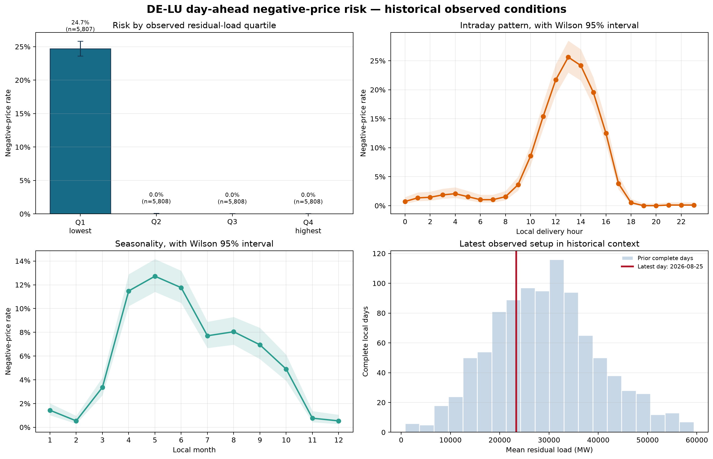
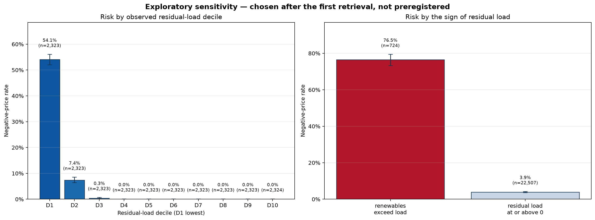

# DE-LU negative-price risk view

Generated from settled SMARD observations. This is a historical analyst case
study, not a live trading signal.

## The short answer

In the retrieved sample, 1,436 of
23,231 complete delivery hours were negative
(6.2%). The clearest descriptive separation
is residual load: the lowest-residual-load quartile had a negative-price rate of
24.7% (95% Wilson interval 23.6%–25.8%,
n=5,807), compared with 0.0% in the
highest-residual-load quartile (95% interval 0.0%–0.1%,
n=5,808).

That pattern is an association in settled data. It does not establish that
residual load causes negative prices, nor that the same variables were
available early enough to trade on.

## Latest observed setup

The latest complete local day in the snapshot was **2026-08-25**.
Its observed averages were 50,818 MW load,
15,922 MW wind and 11,522 MW
solar, leaving 23,374 MW mean residual load.
It recorded 0 negative-price hours out of
24 and a minimum settled price of
62.21 EUR/MWh.

Relative to strictly earlier complete days, its mean residual load was at the
31% percentile. That places the day in a
**middle-of-sample** observed setup. The nearest-day comparison is deliberately
historical: The 5 nearest prior complete days had a mean negative-price rate of 7.5%; their individual rates ranged from 0.0% to 20.8%.

## Primary evidence

### Residual-load strata

The quartile boundaries are calculated from this retrieved sample and are
retrospective descriptive strata, not proposed trading thresholds.

| Stratum | Hours | Negative | Rate | CI low | CI high |
| --- | --- | --- | --- | --- | --- |
| Q1 · lowest residual load | 5,807 | 1,435 | 24.7% | 23.6% | 25.8% |
| Q2 | 5,808 | 1 | 0.0% | 0.0% | 0.1% |
| Q3 | 5,808 | 0 | 0.0% | 0.0% | 0.1% |
| Q4 · highest residual load | 5,808 | 0 | 0.0% | 0.0% | 0.1% |

### Intraday and seasonal context

| Local hour | Hours | Negative | Rate | CI low | CI high |
| --- | --- | --- | --- | --- | --- |
| 0 | 968 | 7 | 0.7% | 0.4% | 1.5% |
| 1 | 968 | 13 | 1.3% | 0.8% | 2.3% |
| 2 | 967 | 14 | 1.4% | 0.9% | 2.4% |
| 3 | 968 | 18 | 1.9% | 1.2% | 2.9% |
| 4 | 968 | 20 | 2.1% | 1.3% | 3.2% |
| 5 | 968 | 15 | 1.5% | 0.9% | 2.5% |
| 6 | 968 | 10 | 1.0% | 0.6% | 1.9% |
| 7 | 968 | 10 | 1.0% | 0.6% | 1.9% |
| 8 | 968 | 15 | 1.5% | 0.9% | 2.5% |
| 9 | 968 | 35 | 3.6% | 2.6% | 5.0% |
| 10 | 968 | 83 | 8.6% | 7.0% | 10.5% |
| 11 | 968 | 149 | 15.4% | 13.3% | 17.8% |
| 12 | 968 | 210 | 21.7% | 19.2% | 24.4% |
| 13 | 968 | 248 | 25.6% | 23.0% | 28.5% |
| 14 | 968 | 234 | 24.2% | 21.6% | 27.0% |
| 15 | 968 | 189 | 19.5% | 17.2% | 22.1% |
| 16 | 968 | 121 | 12.5% | 10.6% | 14.7% |
| 17 | 968 | 37 | 3.8% | 2.8% | 5.2% |
| 18 | 968 | 5 | 0.5% | 0.2% | 1.2% |
| 19 | 968 | 0 | 0.0% | 0.0% | 0.4% |
| 20 | 968 | 0 | 0.0% | 0.0% | 0.4% |
| 21 | 968 | 1 | 0.1% | 0.0% | 0.6% |
| 22 | 968 | 1 | 0.1% | 0.0% | 0.6% |
| 23 | 968 | 1 | 0.1% | 0.0% | 0.6% |

The month-level rates are included as context rather than as a claim that
seasonality is stable across future years:

| Month | Hours | Negative | Rate | CI low | CI high |
| --- | --- | --- | --- | --- | --- |
| 1 | 2,232 | 32 | 1.4% | 1.0% | 2.0% |
| 2 | 2,040 | 11 | 0.5% | 0.3% | 1.0% |
| 3 | 2,229 | 75 | 3.4% | 2.7% | 4.2% |
| 4 | 2,160 | 248 | 11.5% | 10.2% | 12.9% |
| 5 | 2,232 | 284 | 12.7% | 11.4% | 14.2% |
| 6 | 2,160 | 254 | 11.8% | 10.5% | 13.2% |
| 7 | 2,232 | 172 | 7.7% | 6.7% | 8.9% |
| 8 | 2,088 | 168 | 8.0% | 7.0% | 9.3% |
| 9 | 1,440 | 100 | 6.9% | 5.7% | 8.4% |
| 10 | 1,490 | 73 | 4.9% | 3.9% | 6.1% |
| 11 | 1,440 | 11 | 0.8% | 0.4% | 1.4% |
| 12 | 1,488 | 8 | 0.5% | 0.3% | 1.1% |

## Exploratory sensitivity, added after the first retrieval

Neither view below was preregistered. Both were added once the preregistered
quartiles turned out to place almost the entire event mass inside Q1, leaving
Q2 to Q4 nearly empty and hiding how steeply risk varies inside that bottom
quartile. Amendment 1 in <code>PREREGISTRATION.md</code> records that decision
and its date.

They are reported alongside the primary readout, not in place of it. Because
they were chosen with knowledge of the data, their sharper separation is a
description of this sample rather than evidence of the same standing as the
preregistered table above.

### Residual-load deciles

| Stratum | Hours | Negative | Rate | CI low | CI high |
| --- | --- | --- | --- | --- | --- |
| D1 · lowest residual load | 2,323 | 1,256 | 54.1% | 52.0% | 56.1% |
| D2 | 2,323 | 172 | 7.4% | 6.4% | 8.5% |
| D3 | 2,323 | 8 | 0.3% | 0.2% | 0.7% |
| D4 | 2,323 | 0 | 0.0% | 0.0% | 0.2% |
| D5 | 2,323 | 0 | 0.0% | 0.0% | 0.2% |
| D6 | 2,323 | 0 | 0.0% | 0.0% | 0.2% |
| D7 | 2,323 | 0 | 0.0% | 0.0% | 0.2% |
| D8 | 2,323 | 0 | 0.0% | 0.0% | 0.2% |
| D9 | 2,323 | 0 | 0.0% | 0.0% | 0.2% |
| D10 · highest residual load | 2,324 | 0 | 0.0% | 0.0% | 0.2% |

### Renewable surplus: residual load below zero

Unlike the quantile strata, this boundary is fixed by the physics of the
system rather than by the retrieved sample, so it does not move when the
window changes.

| Condition | Hours | Negative | Rate | CI low | CI high |
| --- | --- | --- | --- | --- | --- |
| residual load < 0 MW | 724 | 554 | 76.5% | 73.3% | 79.5% |
| residual load >= 0 MW | 22,507 | 882 | 3.9% | 3.7% | 4.2% |

In this sample, hours in which wind and solar together exceeded German load cleared below zero 76.5% of the time (95% Wilson interval 73.3%–79.5%, n=724), against 3.9% for all other hours (n=22,507).

## Chronological diagnostic

On the untouched final 2026-02-13 to 2026-08-25 period, the untuned logistic diagnostic returned average precision 81.4% versus 8.7% for the prevalence baseline. Its Brier score was 0.0572 versus 0.0802; lower is better. This is an explanatory holdout using observed fundamentals, not evidence of a pre-auction or tradeable signal.

Top standardised model associations (not causal effects):

| Feature | Coefficient | Odds ratio per SD |
| --- | --- | --- |
| residual_load_mw | -5.152 | 0.006 |
| solar_mw | -0.686 | 0.504 |
| hour_cos | -0.615 | 0.540 |
| wind_total_mw | -0.535 | 0.586 |
| month_cos | -0.449 | 0.638 |

## What would invalidate this view?

This view should be treated as stale or incomplete if any of the following
change materially:

- SMARD revises the historical series, changes a filter's meaning or alters
  timestamp conventions;
- new forward weather, outage, interconnector or market-coupling information
  changes the fundamental setup;
- the market-design or regulatory regime changes the relationship between
  renewable surplus and prices;
- the analyst interprets settled actuals as though they were available before
  the day-ahead auction.

The next version should add forward-available inputs and a separate prospective
evaluation before making any pre-auction claim.

## Data boundary

The complete-row window is 2023-12-31T23:00:00+00:00 to
2026-08-25T21:00:00+00:00, covering 968 complete
local days. The snapshot records 705 response reads: 0 retrieved from SMARD during the run that wrote it and 705 read from the local raw-response cache. Of the cached responses, 705 predate retrieval-time recording, so the moment SMARD actually served them is unknown and is reported as null rather than as the cache-read time. See data/provenance.json for URL hashes and both timestamps.

## Data quality

The processed snapshot contains 23,231 rows and 23,231 complete analysis rows. Missing counts in the five source series were: price 0, load 0, onshore wind 0, offshore wind 0, solar 0. Missing values were not converted to zero.

No P&L, execution rule or deterministic “sell” instruction is produced.
